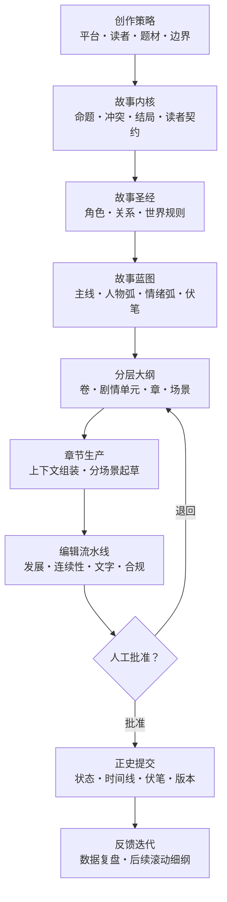
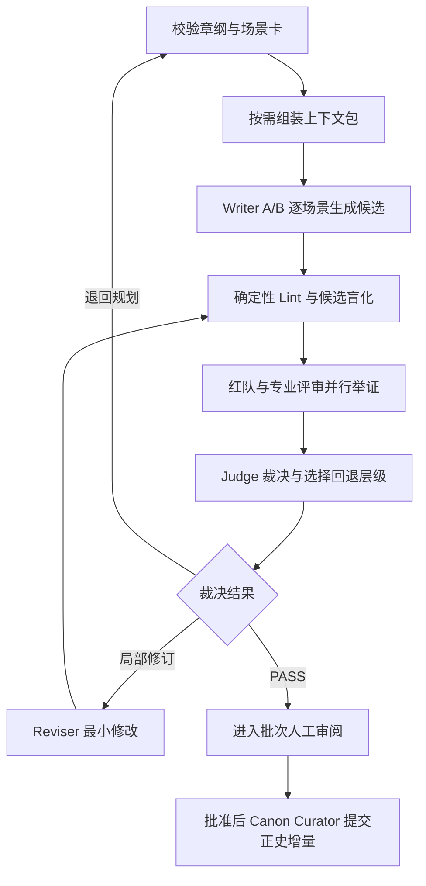
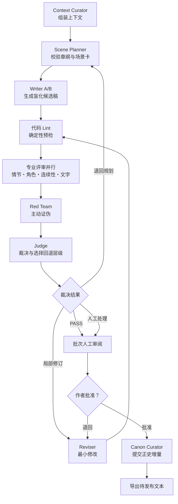
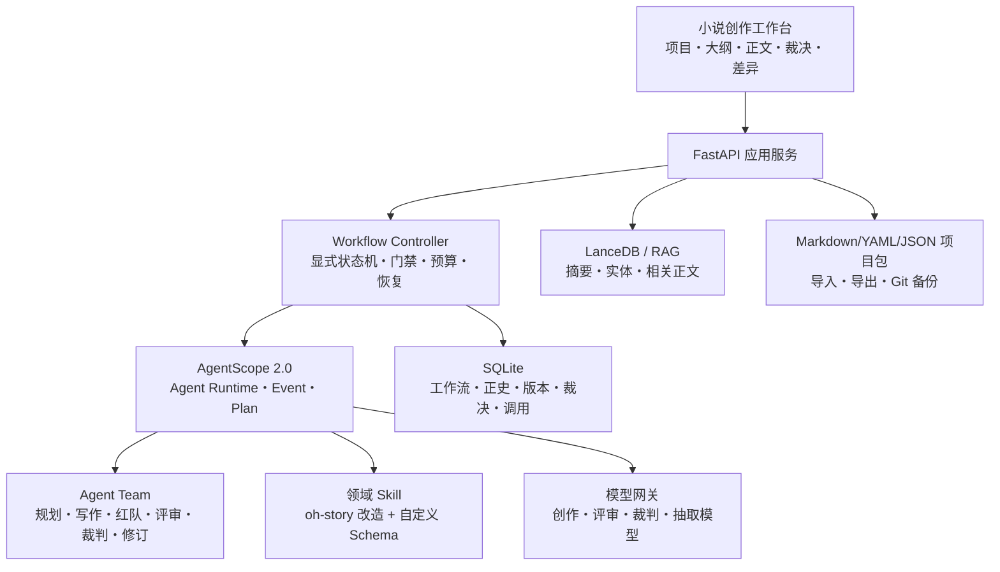
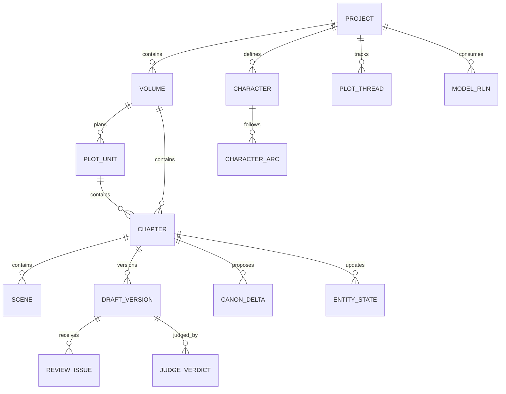

# AI 长篇小说创作智能体：需求与架构设计

> 文档状态：V2.2（多 Agent 对抗评审版）  
> 日期：2026-07-27  
> 目标用户：个人爱好型网络小说作者  
> 主要渠道：番茄小说等网络文学平台  
> 推荐底座：AgentScope 2.0 + 显式小说工作流状态机 + oh-story 方法/Skill  

---

## 1. 文档摘要

本项目建设一个本地优先、开源底座优先的 AI 长篇小说创作智能体。它不是“一键批量发书”工具，而是一套低人工介入的创作与编辑流水线：作者确定创意、人物和关键剧情，智能体负责拆解大纲、生成场景卡、起草章节、检查人物与设定一致性、发现重复和空洞表达、提出修订建议并生成待审稿，最后由作者批量审阅和手动发布。

核心设计结论：

1. 以 **AgentScope 2.0** 作为多 Agent Runtime，使用并发 Agent、Routing、Handoff、Plan、事件流和状态/会话能力承载分角色协作。
2. 在 AgentScope 之外保留一个显式、可持久化的小说工作流状态机；Agent 负责认知任务，状态机负责节点、循环、预算、门禁和恢复。
3. 以 **oh-story-claudecode 的文件化写作工程和方法库**作为创作方法层，将 Skill、Hook 与追踪机制改造成结构化工作流节点。
4. 创作主链升级为“读者契约 → 故事内核 → 角色系统 → 世界规则 → 全书蓝图 → 卷纲 → 剧情单元 → 章纲 → 场景卡 → 候选正文 → 红队与专业评审 → 裁判裁决 → 定向修订 → 正史回写”。
5. 使用“SQLite 业务与工作流真源 + Markdown/YAML 可读项目包 + LanceDB 检索 + 分层记忆”解决长篇连续性和个人部署复杂度。
6. 设置独立 **Judge Agent（裁判员）**：不写正文，只根据证据决定通过、局部修订、退回场景卡、退回章纲或升级人工。
7. 只在项目立项、故事与角色定稿、卷纲确认、批次审稿和最终发布设置人工门禁。
8. 朱雀 AI 检测只作为旁路质量观察工具；内部“对抗检测”针对可读性、逻辑、连续性、模板化和来源风险，不进行检测器规避优化。
9. 不自动登录或自动发布至番茄小说，不模拟用户操作，不绕过平台限制。
10. 所有设定、稿件、评审证据、裁判裁决、提示词、模型参数、人工改动和审批结果均保留版本记录。
11. **首期只运行 AgentScope 一套 Runtime**；OpenFic 和 91Writing 作为产品/UI/领域设计参考，不叠加其 LangGraph Runtime。

### 1.1 对“通过朱雀检测”的处理原则

AI 文本检测存在误判和漏判，不应被当作作者身份或文本质量的确定性证明。OpenAI 曾因准确率低下线自有 AI 文本分类器；2025 年的跨数据集研究也指出，检测器在不同领域会发生明显数据漂移和误判。

因此，本系统不承诺固定“通过率”，也不实现根据检测分数循环改写的规避功能。系统应通过以下方式解决真正的问题：

- 作者提供原创题材选择、人物动机、关键转折和最终取舍。
- 智能体优先改善故事因果、具体场景、人物语言差异和叙事节奏。
- 检查同一作品内部的重复句式、情节复用、设定冲突和空泛段落。
- 对导入参考资料记录来源，只允许使用本人作品、已获授权内容或公共领域资料。
- 每个待发布批次保留人工审阅和确认。
- 将朱雀结果记录为“观察值”，发生异常时进入人工编辑，不自动对抗改写。

---

## 2. 专业小说创作工作流重构

### 2.1 为什么需要重构

小说不是把“角色、大纲、正文”三个提示词串起来。真正可持续的长篇生产至少包含四个相互约束的系统：

1. **创意系统**：决定写什么、给谁看、读者为什么继续看。
2. **戏剧系统**：决定人物为什么行动、冲突怎样升级、选择如何改变局势。
3. **叙事系统**：决定信息以什么顺序交付、每个场景让读者感受什么。
4. **连续性系统**：决定哪些事实已经成为正史，后续写作不能随意推翻。

上一版已经覆盖了 Agent、记忆和技术架构，但创作工序仍偏粗。V2 将“创作产物”定义为工作流的一等对象，每个阶段都有明确输入、输出、门禁、锁定范围和回写规则。

### 2.2 对 oh-story-claudecode 的吸收与改造

[oh-story-claudecode](https://github.com/worldwonderer/oh-story-claudecode) 是一个 MIT 许可的网文写作 Skill 包，当前覆盖扫榜、拆文、长短篇写作、导入、审稿、文字清理和封面等流程；它采用文件系统拆分设定、大纲、正文和追踪，并通过专业 Agent 与 Hook 约束“先有细纲、再写正文”和写后状态更新。

适合直接吸收的设计：

| 能力 | V2 处理 |
|---|---|
| 文件化故事工程 | 保留。设定、大纲、正文、追踪按独立文件维护 |
| 先大纲后正文 | 升级为工作流硬门禁：没有章纲和场景卡不得生成正文 |
| 分层上下文 | 保留。只加载当前章节“不知道就会写错”的信息 |
| 滚动细纲 | 保留。先做全书和卷级骨架，细纲按剧情单元滚动生成 |
| 专业 Agent | 保留角色分工，但改为结构化输入输出和明确写权限 |
| 写后追踪 | 升级为“正史变更提案 → 校验 → 批准 → 原子回写” |
| Hooks | 转换为工作流守卫、事件监听和可恢复任务 |
| 多视角审稿 | 拆成发展编辑、连续性编辑、文字编辑和合规检查 |
| 去 AI 味检查 | 只保留为文字质量 Lint；不进行检测器对抗优化 |

需要收紧或调整的部分：

- 扫榜只能使用公开、授权或作者手工提供的数据，不通过技术手段绕过平台限制。
- 对标分析只保存题材结构、节奏、功能位和作者自己的笔记；未经授权不保存或向模型注入其他作品的完整正文。
- 不要求模仿具体作者文风。系统应优先使用作者自有文本形成风格画像，或使用句长、视角、叙述距离、对白密度等抽象参数。
- 文件系统适合创作，但任务、调用成本和检索索引不宜全部写进 Markdown，因此使用 SQLite 保存运行态。

### 2.3 端到端创作生命周期



工作流不是单向瀑布。允许回退，但必须遵守影响范围：

- 修改场景卡，只影响当前章。
- 修改章纲，影响当前章及直接承接章。
- 修改剧情单元，影响该单元后续章。
- 修改卷纲，影响本卷尚未锁定内容。
- 修改故事内核、结局、核心人物动机或世界硬规则，必须执行全书影响分析。

### 2.4 创作产物分层

| 层级 | 核心问题 | 主要产物 | 锁定时机 |
|---|---|---|---|
| 创作策略 | 为谁写、写什么、边界是什么 | 创作简报、渠道画像、内容边界 | 项目立项 |
| 故事内核 | 这个故事真正讲什么 | 一句话梗概、主题命题、戏剧问题、结局证明 | 开书确认 |
| 读者契约 | 读者持续阅读会得到什么 | 核心期待、兑现方式、禁止透支项 | 开书确认 |
| 故事圣经 | 哪些事实不可随意改变 | 角色、关系、世界观、力量/规则、地点、势力 | 分项确认 |
| 全书蓝图 | 全书如何从开始走到结局 | 主线、人物弧、情绪弧、信息线、伏笔线 | 首卷前确认 |
| 卷纲 | 本卷完成什么状态变化 | 卷目标、起止状态、高潮、阶段债务 | 卷开始前 |
| 剧情单元 | 5～15 章完成哪个局部闭环 | 单元卡、节拍、转折、兑现、新债务 | 单元开始前 |
| 章纲 | 本章为什么必须存在 | 目标、选择、转折、结果、钩子 | 写正文前 |
| 场景卡 | 每个场景如何改变状态 | POV、目标、阻碍、转折、选择、结果 | 写场景前 |
| 正文 | 如何让读者实际经历故事 | 场景正文、章节正文 | 审稿后 |
| 编辑报告 | 稿件哪里不成立 | 分级问题、证据、最小修订指令 | 每章/批次 |
| 正史增量 | 本章改变了什么 | 事实、角色状态、关系、时间线、伏笔变更 | 人工批准后 |

### 2.5 创作策略与故事内核

项目不能从“生成十万字大纲”开始。第一步应形成 `创作简报`：

- 目标渠道、目标读者和阅读场景。
- 主类型、副类型和明确不写的内容。
- 作者真正感兴趣的生活经验、知识或情绪。
- 预计篇幅、更新方式和可承受的人工审阅量。
- 差异化来源：角色职业、矛盾视角、世界规则、叙事结构或作者经验。

第二步形成 `故事内核卡`：

```yaml
premise: 如果……会怎样
logline: 主角 + 目标 + 主要阻碍 + 独特反转
theme_question: 故事持续追问但不提前回答的问题
dramatic_question: 读者追到结局想知道的具体结果
value_shift: 故事核心价值从什么状态转向什么状态
ending_proof: 结局用哪个选择或结果回答主题
reader_promise: 本书稳定交付的阅读体验
expectation_debts: 已向读者许下但尚未兑现的承诺
do_not_write: 内容、风格和剧情边界
```

故事内核通过后，所有卷纲和章节都必须能说明自己如何推进戏剧问题、人物弧或读者契约；三者都不推进的内容原则上删除或合并。

### 2.6 角色系统

角色不能只是一张“姓名、年龄、性格”的静态卡。每个主要角色需要六层信息：

1. **功能位**：主角、对手、盟友、镜像、导师、催化剂、见证者等。
2. **外在目标**：角色眼下明确想得到什么。
3. **内在需要**：角色必须理解或改变什么，才能完成弧线。
4. **动机与恐惧**：为什么非做不可，最怕失去什么。
5. **策略与底线**：习惯怎样解决问题，什么事情绝不会做。
6. **动态状态**：位置、能力、资源、关系、名誉、身体状态、已知信息和秘密。

主要角色档案建议包含：

```yaml
identity:
story_function:
external_goal:
internal_need:
motivation:
fear:
misbelief:
strengths:
flaws:
red_lines:
decision_pattern:
voice_profile:
knowledge_state:
secret_state:
resources:
reputation:
start_state:
turning_points:
end_state:
```

角色设计必须满足：

- 主角拥有关键节点的因果权或关键选择权，不能长期被配角和偶然事件替代。
- 重要收益、认可或权力的最终归属符合前期承诺。
- 反派不是“负责作恶的工具”，其目标和手段在自身逻辑中成立。
- 配角至少承担一种不可替代功能；功能高度重叠的角色应合并。
- 人物弧必须能落到可见选择和行为变化，不能只靠旁白宣告成长。
- 对白画像记录词汇、句长、回避方式、称呼、撒谎方式和压力下的语言变化，不只记录口头禅。

关系不是静态连线，而是状态机：

```text
陌生 → 试探 → 暂时合作 → 信任/依赖 → 破裂/重构
```

每次关系变化必须对应事件、认知变化或代价，不能无原因跳级。

### 2.7 “剧本层”：故事蓝图、节拍与剧情单元

小说不需要照搬影视剧本格式，但需要一个位于“大纲”和“正文”之间的戏剧蓝图层。该层回答的不是“这一章写什么字句”，而是：

- 谁想要什么。
- 谁或什么阻止他。
- 信息、权力或关系在哪里发生变化。
- 主角做出什么不可撤销的选择。
- 这个选择产生什么结果和新问题。

全书蓝图至少包含五条可独立查看的线：

| 故事线 | 追踪内容 |
|---|---|
| 主线事件 | 外部目标、阻碍升级、阶段胜负、终局结果 |
| 主角弧 | 错误认知、压力测试、关键选择、最终改变 |
| 关系弧 | 核心关系的建立、升温、裂变和重构 |
| 信息线 | 读者、主角、对手分别知道什么，何时揭示 |
| 伏笔线 | 埋设、强化、误导、回收和回收后的影响 |

每个剧情单元形成局部戏剧闭环：

```yaml
unit_id:
position_in_volume:
promise_or_debt:
trigger:
protagonist_goal:
opposition:
escalation_beats:
midpoint_change:
irreversible_choice:
climax:
payoff:
aftermath:
new_debt:
character_arc_delta:
relationship_delta:
canon_constraints:
```

剧情单元通常覆盖一组连续章节，正文不得跳过单元中的关键选择，也不得提前消耗终局真相、最终能力上限或核心关系结论。

### 2.8 五级大纲体系

大纲分五级，而不是一个超长文档：

```text
L1 全书蓝图：起点、结局、主要阶段和核心弧线
  └─ L2 卷纲：本卷承诺、起止状态、高潮与新局面
      └─ L3 剧情单元：局部目标、升级节拍、选择、兑现
          └─ L4 章纲：本章的事件、信息、情绪和状态变化
              └─ L5 场景卡：可直接写成正文的最小戏剧单元
```

推荐采用“远处粗、近处细”的滚动规划：

- 全书必须先确定开端、终局方向和主要阶段，但不一次写完所有章纲。
- 当前卷必须有完整卷纲。
- 当前剧情单元必须有完整单元卡。
- 始终保持未来 5～10 章可写的章纲库存。
- 正在写的 1～3 章必须具备完整场景卡。
- 已批准正文对应的章纲和剧情单元进入锁定状态；修改必须走变更影响分析。

首三章额外回答：

- 前 500 字发生了什么可见事件。
- 主角最值得读者关注的特质怎样通过行动体现。
- 核心矛盾何时出现。
- 读者在第三章结束时具体期待什么。
- 作品差异化是否已经出现，而不是只出现通用题材标签。

### 2.9 章纲与场景卡

章纲回答“这一章为什么存在”，至少包含：

- 所属阶段、卷和剧情单元。
- 本章核心事件。
- POV 与时间地点。
- 主角目标和关键选择。
- 起始状态 → 结束状态。
- 目标情绪的前态 → 后态。
- 主线、关系线、信息线和伏笔线的实际增量。
- 本章可揭示和禁止提前揭示的信息。
- 章首进入点、章尾推动力。
- 预计字数及各场景预算。

每个场景卡回答“这个场景如何改变局势”：

```yaml
scene_id:
pov:
time:
location:
entry_state:
goal:
obstacle:
stakes:
turning_point:
choice:
outcome:
emotional_shift:
information_revealed:
information_withheld:
relationship_shift:
canon_delta:
exit_hook:
word_budget:
```

场景有效性检查：

1. 删除场景后，事件、人物、关系、信息或情绪是否完全不受影响？如果是，应删除或合并。
2. 场景结束时至少一个状态是否改变？
3. 转折是否由角色行动、对手反制或已有条件触发，而不是作者强行安排？
4. 该场景是否重复前一场景已经交付的情绪和信息？

### 2.10 单章生产工作流



单章上下文包只包含：

- 本章章纲和场景卡。
- 当前卷、剧情单元和读者契约摘要。
- 上一章结尾及必要的最近正文。
- 本章出场角色的档案和动态状态。
- 本章涉及的世界规则、地点、势力和物件。
- 待推进或回收的相关伏笔。
- 本章所需的作者风格规则。
- 必须遵守的内容边界。

正文按场景生成后再合并，优点是可以分别校验每个场景的目标、转折和状态变化。章节层只负责转场、节奏、叙述距离统一和章尾推动力，不重新发明剧情。

### 2.11 编辑流水线

“审稿 Agent”不应只有一个综合评分。不同编辑解决不同问题：

| 编辑层 | 核心问题 | 典型输出 |
|---|---|---|
| 发展编辑 | 故事是否成立、是否推进、冲突是否升级 | 删除、合并、重排或补强建议 |
| 角色编辑 | 行为是否符合动机、人物弧是否推进 | 动机断点、选择不成立、声音混同 |
| 连续性编辑 | 事实、时间、位置、能力和知识是否冲突 | 带证据位置的冲突报告 |
| 场景编辑 | 场景是否有目标、转折和结果 | 无效场景、重复场景、弱转折 |
| 文字编辑 | 句段是否自然、准确、有节奏 | 最小范围的行文修订 |
| 校对/Lint | 标点、重复、工程词和格式 | 可确定修复项 |
| 合规与来源 | 平台边界、授权和相似风险 | 风险项、来源证据、人工复核 |
| 裁判 | 证据是否成立、采用哪项意见、回退到哪一层 | JudgeVerdict 和最小修订集 |

执行顺序必须从“大问题”到“小问题”。如果剧情结构仍会重写，不应先花费大量调用做逐句润色。

修订规则：

- 审校 Agent 只能提出问题和修订指令，不能直接覆盖正文。
- 修订 Agent 只处理已选择的问题和证据范围。
- 结构问题回退到章纲或场景卡，不能只靠润色掩盖。
- 同一问题最多自动修订两轮，仍未解决则交给作者。
- 确定性 Lint 只阻断明确错误；风格偏好作为提示，避免把所有文本修成同一种腔调。

### 2.12 正史回写与变更控制

正文写完不等于故事事实已经生效。每章生成 `CanonDelta`：

```yaml
new_facts:
character_state_changes:
relationship_changes:
knowledge_changes:
resource_changes:
timeline_events:
foreshadowing_created:
foreshadowing_progressed:
foreshadowing_resolved:
world_rule_proposals:
```

提交顺序：

1. 从批准稿抽取正史增量。
2. 与当前故事圣经和状态快照进行冲突校验。
3. 生成影响摘要。
4. 作者批准章节后，由单一写入器原子更新追踪文件。
5. 创建 Git 检查点，记录章节、版本和变更摘要。

任何 Agent 不得在写正文时同时直接修改正史文件。这样可以避免并行 Agent 互相覆盖和未批准草稿污染后续上下文。

### 2.13 人工介入设计

| 时机 | 默认交互 | 目的 |
|---|---|---|
| 开书 | 选择一个故事内核方案并修改关键项 | 保留作者创意所有权 |
| 故事与角色定稿 | 确认结局方向、主角弧和核心关系 | 防止后续大规模返工 |
| 每卷开始 | 批准卷契约、剧情单元和禁释边界 | 控制长期方向 |
| 每 3～5 章 | 批量查看问题、差异和正史增量 | 降低逐章操作量 |
| 异常升级 | 只处理结构冲突、来源风险和两轮未解决问题 | 将人工投入集中到高价值判断 |
| 发布前 | 最终阅读全文并手工发布 | 保证责任与平台合规 |

系统可以自动生成草稿和编辑建议，但不能自动批准故事内核、核心角色弧、重大正史变更或最终发布。

### 2.14 补充项目与实践资料的结论

新增对照资料进一步证明：本项目应优先建设“创作工作台 + 可见工作流 + 项目记忆”，而不是继续堆叠通用聊天 Agent。

| 对照资料 | 可吸收能力 | 不直接照搬的部分 |
|---|---|---|
| [OpenFic](https://github.com/syrizelink/OpenFic) | 本地优先写作台、自定义工作流、多模型、语义检索、上下文压缩、桌面/Web 交付 | 仍需补齐本项目定义的五级大纲、CanonDelta、批次门禁和渠道导出 |
| [oh-story-claudecode](https://github.com/worldwonderer/oh-story-claudecode) | 文件化创作工程、写前守卫、滚动细纲、状态追踪和多视角审稿 | 将命令/Hook 适配为产品内工作流节点与结构化状态 |
| [91Writing](https://github.com/ponysb/91Writing) | 小说项目、富文本编辑、提示词库、世界观、时间线、成本统计和本地数据的产品形态 | 纯前端形态适合作为 UI 参考，不承担长任务恢复、正史事务和复杂多 Agent 编排 |
| [Manus 文本生成器评测](https://manus.im/zh-cn/blog/best-ai-text-generator) | 展示 Agent 执行步骤、项目级上下文、成果文件与多格式导出的交互思路 | 属于通用生成器和厂商内容，不作为小说质量或技术选型的权威证据 |
| [短篇小说工作流视频](https://www.youtube.com/watch?v=A805OU-YMJM) | 题材选择和流程化生产可形成独立“短篇模式” | 宣称的阅读数据不可独立验证；短篇爆点公式不应直接替代长篇角色弧和连续性 |
| 两份用户提供的实践文章 | 共同强调“先把故事变成项目”、一技能一职责、单章循环、状态更新、定期批审 | “百万字稳定”“固定去 AI 味步骤”等经验性表述仅作假设，必须用本项目回归集验证 |

由此形成四层选型：

1. **交互层：自研轻量写作台，参考 OpenFic/91Writing**——提供编辑器、项目管理、大纲树、差异、裁决和批审视图；可按许可证复用独立前端组件，但不继承另一套 Agent Runtime。
2. **运行层：AgentScope 2.0**——承载分角色 Agent、并发评审、Routing、Handoff、事件流、工具和模型接入。
3. **控制层：显式小说工作流状态机**——负责可恢复节点、最多两轮修订、硬门禁、预算和人工暂停。
4. **方法层：oh-story + 本文领域模型**——定义角色、剧情单元、五级大纲、场景卡、对抗评审、裁判和正史回写。

短篇与长篇可以共享角色、场景卡、审校和正史 Schema，但使用不同工作流模板：

| 模式 | 规划粒度 | 人工门禁 | 质量重点 |
|---|---|---|---|
| 长篇连载 | 全书蓝图 → 卷 → 剧情单元 → 章 → 场景 | 开书、卷、每 3～5 章、发布 | 连续性、期待债务、角色弧、伏笔 |
| 短篇故事 | 选题 → 核心反转/变化 → 节拍 → 场景 → 成稿 | 选题、成稿、发布 | 开场进入速度、单一主线、结尾兑现 |

---

## 3. 项目背景

个人爱好型作者使用大模型写长篇小说时，常见困难不是单章文字生成，而是：

- 几十章后人物性格、关系、能力和时间线发生漂移。
- 大纲与正文脱节，章节看似完整但缺乏推进。
- 同一套句式、情绪和冲突反复出现，形成明显模板感。
- 提示词、角色设定、章节草稿散落在多个聊天窗口中。
- 一次生成失败后无法从中间节点恢复，只能重跑整条链路。
- 多模型调用成本不可控，低价值校对也使用高价模型。
- 缺少版本、差异和人工决策记录，难以长期维护。
- 平台规则持续变化，批量、低质和同质化内容面临治理风险。

本项目重点解决长篇创作的“项目管理、上下文管理、质量闭环和低频人工决策”，而不是追求全自动代替作者。

---

## 4. 产品定位

### 4.1 一句话定位

面向个人作者的本地优先 AI 小说工作台：把作者的创意持续转换成可审阅、可追溯、前后一致的长篇连载稿。

### 4.2 目标

- 降低反复复制设定、补充上下文和整理版本的操作量。
- 支持从创意、故事圣经、卷纲、章纲、场景卡到正文的完整链路。
- 允许按 3～5 章为一个批次生成、检查和审阅。
- 自动发现重大设定冲突、未回收伏笔、角色状态异常和章节重复。
- 支持不同模型提供商和本地模型，避免绑定单一服务。
- 控制每批次调用次数、Token 和预算，失败后可以断点恢复。
- 输出适合网络文学平台手工发布的纯文本和 Markdown。

### 4.3 非目标

- 不建设工作室式批量账号、批量开书或批量发布能力。
- 不自动登录番茄小说，不处理验证码，不规避平台频率限制。
- 不承诺签约、流量、收入或 AI 检测通过率。
- 不复制、洗稿或仿写受版权保护作品。
- 不提供针对特定在世作者的高度模仿模式。
- 首期不做模型微调，不建设 Kubernetes 集群。
- 首期不建设多人协作、复杂权限和商业计费系统。

---

## 5. 用户与使用场景

### 5.1 核心用户

单个个人作者，写作属于业余爱好，希望减少机械整理和初稿劳动，但仍保留题材、人物、剧情和最终文本的决定权。

### 5.2 典型场景

1. 作者输入题材、受众、主角、核心矛盾和禁写项，系统生成三个差异明显的故事方案。
2. 作者选择方案并修改关键设定，系统生成故事圣经和第一卷卷纲。
3. 作者确认卷纲后，系统一次生成 3～5 章的场景卡和初稿。
4. 红队和专业 Reviewer 并行执行情节、角色、连续性、文字和来源检查。
5. Judge 对证据进行裁决，Reviser 按最小修改集执行最多两轮定向修订。
6. 作者查看章节、问题清单和前后版本差异，批量批准或退回。
7. 通过的章节被锁定为当前正史，系统更新人物状态、时间线和伏笔台账。
8. 作者导出平台适配文本，手工完成最终发布。

---

## 6. 低人工介入模型

“低人工”不等于“无人工”。系统采用五类门禁：

| 门禁 | 触发时机 | 作者需要做什么 | 系统自动完成什么 |
|---|---|---|---|
| A. 项目立项 | 新建作品 | 选择创作简报和故事内核 | 生成差异化候选、风险和读者契约 |
| B. 故事定稿 | 首卷开始前 | 确认结局方向、核心角色弧和世界硬规则 | 生成故事圣经和全书蓝图 |
| C. 卷纲确认 | 每卷开始 | 确认卷目标、剧情单元和禁释边界 | 拆分滚动章纲、伏笔与角色弧 |
| D. 批次审稿 | 每 3～5 章 | 查看差异、问题和正史增量，批准或退回 | 起草、审校、定向修订和汇总 |
| E. 发布确认 | 导出前 | 最终阅读全文并确认 | 格式清理、导出和版本归档 |

系统出现以下情况时应主动升级为人工处理：

- 故事圣经存在互相矛盾的硬约束。
- 无法在两轮修订内消除硬门禁问题。
- 模型输出包含来源不明的长段相似文本。
- 内容合规规则命中高风险项。
- 章节方向偏离已批准的卷纲或结局约束。
- 朱雀等旁路观察结果异常且作者希望进一步核查。

---

## 7. 产品范围与优先级

### 7.1 P0：首个可用版本

- 单用户、本地部署。
- 新建作品与项目向导。
- 故事内核、读者契约和故事圣经管理。
- 角色档案、人物弧、关系状态和世界规则管理。
- 全书蓝图、卷纲、剧情单元、章纲和场景卡生成。
- Writer A 章节批量生成，关键章节支持 Writer B 候选。
- 红队、情节、角色、连续性、文字和来源评审并行。
- 独立 Judge Agent 裁决、选择候选并决定回退层级。
- Reviser 按裁决自动定向修订，最多两轮。
- 章节编辑器、版本历史和差异查看。
- CanonDelta、人工批准与正史锁定。
- Markdown、TXT 导出。
- 模型、Token、耗时和成本记录。
- 任务失败重试和断点恢复。

### 7.2 P1：长篇稳定性增强

- 人物关系图、时间线和地点状态视图。
- 伏笔创建、提醒、回收和逾期检查。
- 按人物、地点、物件和事件进行语义检索。
- 风格画像和人物对白画像。
- 多模型路由与降级。
- 朱雀人工检测记录页。
- 番茄等渠道的格式模板和发布前检查清单。
- 作品全量备份、恢复和迁移。

### 7.3 P2：优化与实验能力

- 相同章纲的多版本候选和盲评。
- 读者反馈录入与问题归因。
- 章节质量趋势和角色出场统计。
- 经作者确认的专属语料检索。
- 本地模型与云模型的 A/B 评估。
- 跨作品复用的作者自有世界观模板。

---

## 8. 功能需求

### 8.1 项目向导

系统通过一页表单收集：

- 题材、目标读者和预计篇幅。
- 一句话故事、核心冲突和结局倾向。
- 主角欲望、缺陷、代价和成长方向。
- 世界观边界、叙事视角、时态和语言尺度。
- 必须出现、禁止出现和待探索的元素。
- 更新节奏和单章目标字数。
- 发布渠道配置。

系统输出三个候选方案，每个方案必须包含卖点、核心矛盾、主要人物、三段式或多卷结构、差异点和主要风险。方案不能只替换人名和背景。

验收要求：

- 所有项目字段可随时编辑并保留版本。
- 用户未确认前，候选方案不得成为正式故事圣经。
- 禁写项必须传递到后续所有生成和审查任务。

### 8.2 故事圣经

故事圣经是最高优先级的创作约束，包含：

- 作品定位与主题边界。
- 世界规则及规则例外。
- 人物档案、人物秘密和人物弧。
- 人物关系和关系变化条件。
- 地点、组织、物件和能力体系。
- 时间线和重要历史事件。
- 主线、支线、伏笔及预期回收范围。
- 叙事规则、对白规则和内容边界。

故事圣经采用结构化字段保存，不只保存为一段自然语言。任何 Agent 修改正史字段都必须创建变更提案，由 Canon Curator 生成影响报告、Judge 校验依据，并由作者确认。

### 8.3 大纲与场景卡

层级结构：

```text
作品目标
  └─ 卷目标
      └─ 章节目标
          └─ 场景目标
```

每章至少记录：

- 章节目的。
- 视角人物。
- 开场状态。
- 场景目标、阻碍、选择和结果。
- 本章新增信息。
- 人物状态变化。
- 推进或新建的伏笔。
- 结尾张力类型。
- 与前后章节的因果连接。

系统不得把“结尾必须留悬念”机械化为每章相同的突然中断，应支持问题、选择、信息差、代价、关系变化和目标升级等不同收束方式。

### 8.4 章节生产

章节任务输入由系统自动组装：

- 当前章纲和场景卡。
- 故事圣经中与本章相关的硬约束。
- 最近章节原文的有限窗口。
- 过去章节摘要。
- 相关人物、地点、物件和伏笔状态。
- 作者确认的风格规则。
- 上一轮审校意见。

章节任务输出：

- 正文。
- 章节摘要。
- 实体状态变更提案。
- 新增事实和伏笔提案。
- 对大纲的偏离说明。
- 模型、提示词版本和生成参数。

正文必须与结构化元数据分离，避免审校元信息混入最终稿。

### 8.5 连续性检查

连续性审校至少覆盖：

- 人物年龄、身份、称谓、能力和伤病状态。
- 人物已知信息与未知信息。
- 人物所在位置和移动所需时间。
- 道具归属、数量、损坏和使用状态。
- 时间先后、昼夜、日期和事件间隔。
- 世界规则及能力上限。
- 已发生事件是否被后文错误重置。
- 伏笔是否遗忘、提前揭露或重复回收。
- 角色语言和行为是否明显违背已批准画像。

问题等级：

- P0：破坏故事成立的硬冲突，必须修复。
- P1：读者容易察觉的连续性或因果问题，原则上修复。
- P2：风格、节奏和表达建议，由 Judge 根据证据与项目偏好决定是否采纳。

### 8.6 质量审校

质量审校不以“像不像 AI”作为目标，而以读者体验为目标：

- 章节是否发生了不可替代的变化。
- 事件是否由人物选择和前置条件推动。
- 对话是否具有角色差异，并对关系或信息产生作用。
- 是否存在连续的大段抽象解释而缺乏动作、场景或具体对象。
- 相邻章节是否重复同一冲突、结论或情绪。
- 段落与句式是否机械重复。
- 章首、转场和章尾是否长期使用同一模板。
- 是否存在无来源的常识断言或明显事实错误。
- 是否出现提示词、审校意见、模型自述等泄漏。

上述维度由不同 Reviewer 独立检查。单个 Reviewer 无权决定通过或覆盖正文，最终由 Judge 对证据和回退层级作出裁决。

### 8.7 原创性与来源管理

- 导入资料时必须选择：本人原创、已获授权、公共领域、事实资料或其他。
- 默认禁止将网络小说全文或大段章节作为模仿语料。
- 参考资料仅用于事实检索和高层结构分析，不直接进入正文提示词。
- 使用 n-gram、MinHash 或相似度方法检查作品内部重复与导入资料相似片段。
- 命中长片段相似时阻止进入待发布状态，由作者确认来源和处理方式。
- 保留从作者输入、AI 初稿到人工修改的版本差异，形成创作过程记录。

### 8.8 朱雀检测观察

朱雀页面目前应按外部交互工具处理，首期不假设存在公开、稳定、可自动调用的 API。

P1 页面提供：

- 复制待检测章节。
- 打开朱雀官方检测页。
- 手工录入检测时间、结果、备注和截图引用。
- 将结果关联到具体章节版本。
- 异常时创建“人工复核”任务。

禁止实现：

- 自动抓取检测页面或绕过验证码。
- 根据检测分数无限循环同义改写。
- 以某个分数作为发布门槛或作者身份结论。
- 隐藏 AI 参与记录或伪造人工创作过程。

### 8.9 审阅与版本

编辑器至少支持：

- 原稿、修订稿和当前稿三栏或双栏差异。
- 接受单项修改、整章接受、整章退回。
- 对某段添加作者指令并只重写该段。
- 锁定段落，后续自动修订不得修改。
- 查看本章引用了哪些故事圣经条目。
- 查看本章导致的实体状态变更。
- 回退到任意历史版本。

章节状态：

```text
PLANNED → DRAFTING → ADVERSARIAL_REVIEW → JUDGING
        → NEEDS_REVISION / NEEDS_REPLAN
        → HUMAN_REVIEW → APPROVED → CANON_LOCKED → EXPORTED
```

任何硬门禁问题未关闭或 `JudgeVerdict` 不是 `PASS` 时，不允许进入 `APPROVED`。

### 8.10 渠道导出

渠道配置包含：

- 单章目标字数和允许范围。
- 标题格式。
- 段落空行、特殊符号和敏感词检查规则。
- 简介、标签和作者备注模板。
- 发布前检查清单。

首期输出：

- 每章独立 TXT。
- 整卷或整书 TXT。
- Markdown 项目包。
- 章节元数据 JSON。

平台规则可能变化，系统只提供可编辑模板，不在代码中永久写死规则。发布由作者在平台官方后台手工完成。

### 8.11 成本与运行观察

每次模型调用记录：

- 作品、批次、章节和 Agent。
- 模型提供方与模型标识。
- 输入与输出 Token。
- 延迟、重试次数和错误。
- 估算成本。
- 提示词版本。
- 关联的输入和输出版本。

用户可设置：

- 单章最大调用次数。
- 单批次最大 Token 或预算。
- 自动修订最大轮数，默认 2。
- 高价模型允许执行的 Agent。
- 超出预算后的暂停或降级策略。

---

## 9. 多智能体设计

### 9.1 设计原则

- Agent 是独立职责、独立上下文和独立输出 Schema；可以共享模型，但写作、评审、裁判和修订必须是不同 Agent 实例。
- **写手不审自己、评审不直接改稿、裁判不写正文、修订者不自行新增问题**，形成职责分离。
- 所有 Agent 通过结构化状态交换信息，不依赖无限增长的聊天历史。
- 专业评审彼此独立输出，不先讨论；避免相互暗示和群体意见收敛。
- 裁判只能依据正文、已批准约束和带证据的评审报告裁决，不依据模型品牌、朱雀分数或评审者措辞强弱。
- 红队 Agent 的任务是主动证伪：“这章为什么不成立”，不是笼统挑刺或追求所有指标满分。
- 审校 Agent 只输出问题、证据位置、违反的约束和建议回退层级。
- 修订 Agent 只处理已选择的问题，避免“越改越偏”。
- 同一稿件最多执行两轮“评审 → 裁决 → 修订”；仍不通过则升级人工。
- 正史只能由 Canon Curator 提案，并在章节批准后提交。

### 9.2 Agent 清单

| 分组 | Agent | 核心职责 | 主要输出 | 写权限 |
|---|---|---|---|---|
| 控制 | Producer / Orchestrator | 读取工作流状态，分配 Agent、控制预算与循环 | 节点命令、任务包 | 只写运行态 |
| 策略 | Reader Strategist | 判断读者契约、类型预期、兑现节奏 | 读者契约与期待债务 | 仅提案 |
| 规划 | Story Architect | 故事内核、全书蓝图、卷纲、剧情单元 | 结构化故事方案 | 仅提案 |
| 规划 | Character Director | 角色功能、动机、人物弧、关系与声音 | 角色卡与关系状态机 | 仅提案 |
| 规划 | World/Canon Designer | 世界规则、时间线、地点、组织和能力边界 | 世界设定提案 | 仅提案 |
| 规划 | Outline & Scene Planner | 剧情单元拆解为章纲与场景卡 | 章纲、场景卡、信息边界 | 可改未锁定大纲 |
| 上下文 | Context Curator | 检索本章必要正史、近文、伏笔和角色状态 | `ChapterContextPackage` | 否 |
| 生成 | Writer A | 按场景卡创作主候选稿 | `DraftCandidate A` | 只写候选正文 |
| 生成 | Writer B（条件启用） | 使用相同约束生成差异化候选 | `DraftCandidate B` | 只写候选正文 |
| 对抗 | Red-Team Critic | 主动寻找结构漏洞、套路化、强行转折和读者预期违约 | 攻击报告与失败样例 | 否 |
| 评审 | Plot Reviewer | 检查推进、因果、冲突、选择、节奏和兑现 | 情节问题报告 | 否 |
| 评审 | Character Reviewer | 检查动机、OOC、人物弧、关系变化和对白区分 | 角色问题报告 | 否 |
| 评审 | Continuity Reviewer | 检查事实、时间、位置、物件、能力和已知信息 | 连续性问题报告 | 否 |
| 评审 | Prose & Naturalness Reviewer | 检查重复、空泛、模板句、同腔对白和叙事距离 | 文字问题报告 | 否 |
| 评审 | Reader Advocate | 以目标读者视角检查无聊段、信息负担、钩子和兑现 | 阅读体验报告 | 否 |
| 评审 | Source & Compliance Reviewer | 检查来源相似、渠道规则和内容边界 | 风险报告 | 否 |
| 观察 | Detector Observer（可选） | 记录作者手工提供的朱雀等外部观察结果 | 版本关联的观察记录 | 否 |
| 决策 | **Judge / 裁判员** | 合并证据、解决冲突意见、选择候选并决定回退层级 | `JudgeVerdict` | 否 |
| 修订 | Reviser | 严格执行裁判给出的最小修改集 | 修订稿与变更说明 | 只改授权范围 |
| 正史 | Canon Curator | 从批准稿抽取并校验 CanonDelta | 正史增量提案 | 批准后单写 |

不是所有 Agent 每章都必须运行：

- 普通章：Writer A + Red Team + Plot/Character/Continuity/Prose 四评审 + Judge。
- 关键章、首三章、卷末和大结局：增加 Writer B、Reader Advocate、Source Reviewer，并可启用第二裁判盲评。
- 确定性格式、重复片段、实体字段和敏感规则优先由代码 Lint 完成，不浪费模型调用。

### 9.3 “对抗检测”机制

这里的“对抗”是让红队和专业评审主动寻找稿件不能成立的证据，而不是规避外部 AI 检测器。

**硬门禁：命中即不得通过**

| 硬门禁 | 判定依据 | 默认回退 |
|---|---|---|
| 正史冲突 | 与已批准人物、世界规则、时间线或状态矛盾 | 场景卡或正文 |
| 信息越权 | POV 角色使用其不可能知道的信息 | 场景卡 |
| 因果断裂 | 关键结果缺少前置条件或依赖偶然强推 | 章纲/场景卡 |
| 核心约束违背 | 提前揭示、越过能力上限、破坏结局边界 | 剧情单元/章纲 |
| 来源风险 | 与未授权资料出现未处理的长片段相似 | 人工复核 |
| 内容边界 | 违反项目禁写项或当前渠道硬规则 | 正文/人工复核 |
| 工程污染 | 出现提示词、JSON、审校内容或模型自述 | 正文 |

**软质量攻击：由裁判综合判断**

- 本章删掉后是否对事件、关系、信息或情绪没有影响。
- 主角是否失去关键选择权，靠旁人或巧合解决问题。
- 冲突、转折和章尾是否复用前几章模板。
- 对话是否换一个人物仍然成立。
- 是否用抽象判断代替可见场景与行动。
- 是否重复解释读者已经知道的内容。
- 是否为了制造钩子而故意截断完整场景。
- 期待债务是否只新增不兑现，或透支终局资源。
- 语言是否出现高密度套话、整齐句式和同质段落。

红队输出必须包含：

```yaml
issue_id:
claim:
evidence:
violated_rule:
severity:
failure_consequence:
recommended_rollback_level:
confidence:
```

没有正文证据或结构化约束依据的问题，裁判不得采纳为阻断项。

朱雀等外部检测结果走旁路：Detector Observer 只关联章节版本、时间和人工备注，不把检测分数发给 Writer/Reviser，也不触发自动同义改写。异常结果最多将稿件升级到 `HUMAN_REVIEW`。

### 9.4 裁判员设计

Judge 不做“综合润色”，只做司法式裁决：

```yaml
verdict: PASS | REVISE_LOCAL | REPLAN_SCENE | REPLAN_CHAPTER | HUMAN_REVIEW
selected_candidate:
hard_gate_failures:
accepted_issues:
rejected_issues:
conflicting_reviews:
revision_scope:
locked_strengths:
rollback_target:
recheck_requirements:
reasoning_summary:
```

裁判规则：

1. 先执行硬门禁，再评价软质量；硬冲突不能被高文笔分抵消。
2. 评审报告匿名化，隐藏 Agent 名、模型名和候选稿生成模型。
3. 裁判逐项接受或驳回评审意见，并说明对应证据。
4. 裁判不能直接生成替换正文，防止“既当裁判又当选手”。
5. `REVISE_LOCAL` 必须给出段落或场景范围和不得破坏的优点。
6. 结构问题必须退回章纲/场景卡，不能用文字润色掩盖。
7. Writer 与 Judge 优先使用不同模型或不同模型族，降低相关性偏差；预算不足时也必须使用独立上下文。
8. 第二轮仍有硬门禁失败，自动进入 `HUMAN_REVIEW`。

### 9.5 评审评分与裁决关系

评分只用于辅助排序，不直接替代裁判：

| 维度 | 建议权重 |
|---|---:|
| 情节推进与场景必要性 | 20 |
| 因果、冲突与角色选择 | 15 |
| 人物一致性与人物弧 | 15 |
| 正史与连续性 | 15 |
| 读者契约与兑现 | 10 |
| 节奏、信息密度与钩子 | 10 |
| 语言自然度与角色声音 | 10 |
| 来源清晰度与内容边界 | 5 |

规则优先级为：

```text
硬门禁 > 裁判证据裁决 > 分项评分 > 外部 AI 检测观察值
```

---

## 10. 核心工作流



规划阶段同样采用“小型对抗”：

1. Story Architect、Character Director 和 Reader Strategist 独立提交方案。
2. Red Team 检查卖点不可持续、主角无主动性、终局资源提前透支等风险。
3. Concept Judge 选择或组合方案，作者只确认最终候选。
4. 卷纲和剧情单元重复该机制，但减少评审角色以控制成本。

### 10.1 任务状态与恢复

每个节点执行前保存输入快照，执行后保存输出快照。任务失败后只重跑当前节点，不重新生成已批准内容。

每个任务必须具备：

- `job_id`、`project_id`、`chapter_id` 和 `batch_id`。
- 当前节点、尝试次数和租约时间。
- 输入版本和输出版本。
- 可重入标记。
- 预算消耗。
- 错误类型和可重试判断。

---

## 11. 总体技术架构



架构原则是“显式工作流管状态，AgentScope 管 Agent”。不让 AgentScope 自由决定是否跳过章纲、是否提交正史或是否继续无限讨论；这些必须由 Workflow Controller 的确定性规则控制。

OpenFic 和 91Writing 用作产品功能、编辑器交互、数据结构和本地化体验参考。若复用其前端代码，必须通过稳定 API 与 AgentScope 后端连接，不引入其 LangGraph Runtime，避免双运行时。

### 11.1 分层职责

#### 交互层

- 项目向导。
- 故事圣经和大纲树。
- 章节编辑器。
- 问题与差异视图。
- 批次运行、暂停、继续和取消。
- 模型、预算和渠道配置。

#### 应用服务层

- 项目、章节、版本和审批 API。
- 任务命令校验。
- 导出与备份。
- 身份和本地访问控制。

#### 工作流层

- 自研小型显式状态机，状态持久化到 SQLite。
- 任务依赖、分支、重试和最大循环次数。
- 评审并行、裁判汇总和候选稿盲化。
- 人工门禁。
- 预算门禁。
- 正史锁定和回滚。
- 进程重启后从最后成功节点恢复。

#### Agent Runtime 层

- AgentScope Agent 生命周期、消息、事件流和工具注册。
- Concurrent Agents 并行执行专业评审。
- Routing 根据章节类型、成本和问题类型选择 Agent。
- Handoff 将裁判批准的问题交给对应 Reviser。
- Plan 记录复杂规划任务，但最终状态仍由 Workflow Controller 决定。
- Agent Team 用于关键章节的候选生成、红队和裁判协作。

不采用无限开放群聊。AgentScope 的多 Agent 能力用于有边界的“独立提交 → 裁判汇总 → 定向返工”，所有交换结果都通过 Pydantic Schema 校验。

#### 记忆与知识层

- SQLite 中的结构化正史、评审证据、裁决和审批记录。
- 最近章节窗口。
- 分层摘要。
- 实体和情节状态。
- LanceDB 语义检索和确定性字段查询。
- 来源与版本记录。

Markdown/YAML 项目包是可读、可迁移的交换格式；数据库是应用运行真源。每次批准批次后自动导出项目包并创建可选 Git 检查点，避免要求数据库与手工文件同时作为双主写源。

#### 模型层

- 高能力模型：故事规划、章节起草和复杂修订。
- 独立评审/裁判模型：尽量与 Writer 使用不同模型族，降低共同盲区。
- 低成本模型：实体抽取、格式检查、问题分类和摘要。
- 本地模型：隐私敏感的抽取、搜索和离线实验。

---

## 12. 长篇记忆架构

### 12.1 四类记忆

| 记忆类型 | 内容 | 更新频率 | 使用方式 |
|---|---|---|---|
| 正史记忆 | 世界规则、人物档案、硬约束 | 人工批准后 | 强制注入相关条目 |
| 情节记忆 | 卷纲、章纲、伏笔、未解决冲突 | 每章后 | 按当前章节目标检索 |
| 状态记忆 | 人物位置、物件、关系、已知信息 | 每章锁定后 | 结构化查询和冲突检查 |
| 文本记忆 | 原文、章节摘要、场景摘要 | 每次保存 | 最近窗口 + 语义检索 |

### 12.2 上下文组装顺序

1. 系统级创作与安全规则。
2. 本章任务和输出 Schema。
3. 相关正史硬约束。
4. 当前卷纲、章纲和场景卡。
5. 最近 1～2 章的必要原文窗口。
6. 更早章节的分层摘要。
7. 与本章实体和伏笔相关的检索片段。
8. 作者批准的风格规则。

超过上下文预算时，优先保留硬约束、章纲和实体状态，优先压缩早期原文和低相关检索片段。

### 12.3 记忆更新规则

- AI 生成的状态变化先写入 `proposed` 区。
- 连续性审校通过且作者批准章节后，才写入 `canon` 区。
- 正史字段修改必须记录旧值、新值、原因、影响章节和批准人。
- 回退章节时，关联的正史变更也必须一起回退或重新计算。

---

## 13. 领域模型

### 13.1 核心实体

| 实体 | 关键字段 | 说明 |
|---|---|---|
| Project | id、title、genre、status、channel_profile | 一部作品 |
| CreativeBrief | audience、channel、length、boundaries、review_budget | 创作策略 |
| StoryKernel | premise、logline、theme_question、ending_proof | 故事内核 |
| ReaderContract | promises、payoff_modes、debts、forbidden_overdraft | 读者契约 |
| StoryBible | version、theme、narrative_rules、constraints | 故事圣经版本 |
| Volume | goal、start_state、end_state、status | 卷结构 |
| PlotUnit | trigger、goal、escalation、choice、payoff、new_debt | 剧情单元 |
| Chapter | order、title、status、target_words | 章节主记录 |
| Scene | goal、conflict、choice、outcome、pov | 场景卡 |
| Character | identity、desire、flaw、voice_profile | 人物档案 |
| CharacterArc | start_state、turning_points、end_state | 人物弧 |
| RelationshipState | parties、state、evidence、changed_at | 动态关系 |
| EntityState | entity_id、chapter_id、state_type、value | 章节边界状态 |
| PlotThread | setup、progress、planned_payoff、status | 主线、支线或伏笔 |
| TimelineEvent | time_anchor、participants、location | 时间线事件 |
| DraftVersion | source、content、prompt_version、model_run | 正文版本 |
| ReviewIssue | type、severity、evidence、suggestion、status | 审校问题 |
| JudgeVerdict | verdict、accepted_issues、revision_scope、rollback_target | 裁判裁决 |
| CanonDelta | base_version、changes、impact、commit_status | 正史增量提案 |
| Approval | target_type、target_version、decision、note | 人工门禁 |
| SourceRecord | source_type、license、usage_scope、fingerprint | 来源与授权 |
| ModelRun | provider、model、tokens、latency、cost、status | 模型调用 |
| ExportPackage | channel、chapter_versions、format、checksum | 导出包 |

### 13.2 关键关系



---

## 14. 开源产品底座与 AI 框架选型

### 14.1 总体路线对比

| 路线 | 优势 | 代价 | 结论 |
|---|---|---|---|
| OpenFic + 原生 LangGraph | 最快得到可用写作台，已有本地存储、检索和工作流 | 多 Agent 对抗、裁判、角色权限和 Agent Team 需要在现有 Runtime 内重构 | 若目标只是快速可用，仍是首选 |
| **AgentScope + 自研轻量工作台** | 原生面向多 Agent、并发、Routing、Handoff、事件、Plan、RAG 和 Agent Service；便于实现分角色对抗与裁判 | 需要建设小说编辑器、领域存储和显式状态机 | **当前需求主路线** |
| AgentScope + 复用 OpenFic 独立前端能力 | 可兼顾成熟交互和多 Agent Runtime | 必须拆清前后端边界，不能同时保留 LangGraph；上游同步成本较高 | 可在 P1 评估 |
| 91Writing 纯前端 + AgentScope API | 前端简单、本地化、MIT 许可 | 数据模型和编辑能力需要较多改造 | UI 原型备选 |

本次选择发生变化的原因不是 AgentScope 突然“优于”LangGraph，而是需求重点从“尽快得到一个写作工具”明确转向“设计多 Agent 分工、红队对抗和独立裁判”。选型单位因此从完整应用底座变成多 Agent Runtime。

### 14.2 Agent Runtime 对比

| Runtime | 适用情况 | 本项目决策 |
|---|---|---|
| **AgentScope 2.0** | 多角色 Agent、并发评审、Agent Team、Routing、Handoff、事件流、状态/会话与服务化 | **P0 主 Runtime** |
| LangGraph | 强确定性图编排、Checkpoint 和人机中断 | 不引入；其确定性能力由轻量 Workflow Controller + SQLite 实现 |
| CrewAI | 快速展示角色式协作 | 不选；领域事务和恢复仍需自建 |
| Qwen-Agent | 模型路线主要绑定 Qwen 生态 | 作为模型/工具实验，不作应用底座 |

AgentScope 2.0 官方当前提供 Event System、Permission、Workspace/Sandbox、Middleware、多会话服务、Concurrent Agents、Routing、Handoff、Plan、RAG、Tracing 和 Evaluation。这些能力与“角色隔离—并发举证—裁判汇总—定向转交”高度吻合。

但 AgentScope 的设计更鼓励发挥模型自主推理与工具能力，因此必须由应用层状态机限制创作主链。AgentScope 不直接拥有修改正史、跳过门禁或无限召回其他 Agent 的权力。

### 14.3 为什么不直接选择纯聊天式多 Agent

小说长篇生产需要确定的前后状态和可恢复节点。自由聊天式协作可能产生：

- 同一事实被多个 Agent 各自改写。
- 上下文随轮次膨胀。
- 失败后难以定位从哪一步重跑。
- 同一个输入多次运行结果差异过大。
- 审校意见无法准确关联正文位置和版本。

所以应采用“显式工作流负责控制，Agent 负责认知任务”的组合。

### 14.4 二次开发边界

**AgentScope 负责：**

- Agent、Message、Tool、Skill、Agent Team 和模型适配。
- 并发评审、Routing、Handoff、Plan、事件流与可观测性。
- Writer、Red Team、Reviewer、Judge、Reviser 等角色运行。

**应用层负责：**

- `StoryKernel`、`ReaderContract`、`PlotUnit`、`CharacterArc`、`SceneCard`、`ReviewIssue`、`JudgeVerdict` 和 `CanonDelta`。
- 显式工作流、幂等、两轮上限、预算、人工门禁、失败恢复和正史事务。
- 小说编辑器、五级大纲、裁决证据、版本差异和批次审批。
- 渠道模板、来源登记、相似风险和手工导出。

**参考项目负责提供设计输入：**

- OpenFic：工作台布局、上下文管理、Agentic RAG、Skill 和本地化产品体验。
- 91Writing：小说管理、世界观、时间线、提示词库、成本和进度界面。
- oh-story：创作方法、文件组织、写前守卫、滚动大纲、状态追踪和审稿方法。

如果复用任何项目代码，必须保留许可证和 NOTICE，并将复用层与小说领域层隔离。

---

## 15. 推荐技术栈

### 15.1 P0 技术栈

| 层次 | 选择 | 说明 |
|---|---|---|
| 应用形态 | 本地优先轻量小说工作台 | 参考 OpenFic/91Writing，不绑定其 Runtime |
| 前端 | React 或 Vue 3 + TypeScript + 编辑器组件 | 五级大纲、正文、评审证据、裁决和差异 |
| API | Python 3.11+ + FastAPI | 与 AgentScope 技术栈一致 |
| Agent Runtime | **AgentScope 2.0** | 多角色、并发、Routing、Handoff、事件和 Plan |
| 工作流控制 | 自研有限状态机 | 明确节点、门禁、循环、预算和恢复 |
| 业务数据库 | SQLite + SQLModel/Alembic | 适合单用户本地应用，便于备份迁移 |
| 工作流持久化 | SQLite WorkflowRun/NodeRun 快照 | 节点级幂等、暂停与恢复 |
| 语义检索 | LanceDB + FastEmbed 或 AgentScope RAG 适配 | 全文硬查询仍走结构化字段 |
| 方法/Skill | oh-story 适配 + 自定义 YAML Skill | 吸收写作方法，输出严格 Schema |
| 项目交换格式 | Markdown + YAML + JSON | 人可读、可迁移、可选 Git 版本 |
| 导出 | Python 渠道模板 | TXT、Markdown、JSON，发布仍由作者手工完成 |
| 部署 | Docker Compose 或本地启动器 | 单用户一键启动 |
| 测试 | pytest + Playwright | Agent 契约、裁判、工作流、回归样本和 UI |

### 15.2 模型接入

模型层必须通过统一接口，不在业务代码中直接绑定供应商。建议配置：

- `creative_model`：大纲、章节初稿、复杂修订。
- `review_model`：红队、情节、角色、连续性和文字审校。
- `judge_model`：独立裁决，优先与 `creative_model` 使用不同模型族。
- `extract_model`：实体抽取、摘要、分类，可选择小模型。
- `embedding_model`：中文语义检索。
- `fallback_model`：主模型不可用时降级。

“开源底座优先”不等同于首期必须自建大模型服务。对个人爱好项目，优先使用按量 API 验证工作流通常更省时间；隐私、成本或离线需求明确后，再通过 Ollama 或 vLLM 接入许可证适合的本地模型。

### 15.3 不建议首期引入

- AgentScope 与 LangGraph 双 Runtime。
- PostgreSQL、Redis 和独立 Worker 集群。
- Kubernetes。
- Kafka。
- 多租户权限中心。
- 第二套独立向量数据库。
- 模型微调平台。
- 评审 Agent 之间无限开放辩论。
- 裁判直接重写正文或兼任 Writer。
- 自动网页发布和浏览器机器人。

这些组件对单用户项目的复杂度高于其首期收益。

---

## 16. 模块设计

```text
apps/
  web/                          # 小说工作台
    project/
    story-bible/
    outline-tree/
    chapter-editor/
    review-evidence/
    judge-verdict/
    batch-approval/
  api/                          # FastAPI
services/
  workflow_controller/          # 有限状态机、幂等、重试、预算和人工门禁
  agent_runtime/                # AgentScope 初始化、事件、模型和工具
  agent_teams/
    planning_team/              # 读者策略、故事、角色、世界、大纲
    writing_team/               # Writer A/B、场景规划
    review_team/                # 红队与专业评审
    judgment_team/              # Judge、可选 Second Judge
    revision_team/              # 定向修订
    canon_team/                 # 正史提取与校验
  context_builder/              # ChapterContextPackage
  memory_retrieval/             # 正史、摘要、实体和 RAG
  quality_lint/                 # 重复、格式、来源、确定性规则
  channel_export/               # 番茄等可编辑导出模板
domain/
  schemas/
    story/
    outline/
    draft/
    review_issue/
    judge_verdict/
    canon_delta/
  repositories/
  state_machine/
skills/
  oh_story_adapted/
  project_custom/
prompts/
  planning/
  writing/
  red_team/
  reviewers/
  judge/
  revision/
tests/
  agent_contract/
  judge_calibration/
  workflow/
  regression/
  e2e/
```

AgentScope 只出现在 `services/agent_runtime` 和 `services/agent_teams`。领域 Schema、工作流状态、存储和正史事务不得依赖 AgentScope 私有对象，确保未来可替换 Runtime。

提示词和 Skill 作为代码管理，必须包含版本号、适用模型、输入 Schema、输出 Schema、变更原因、来源许可证和回归测试集。

---

## 17. 质量门禁

### 17.1 发布前必须满足

- 所有硬门禁问题数量为 0。
- 所有 P1 问题已修复或由作者显式忽略并记录原因。
- 当前稿件的最终 `JudgeVerdict` 为 `PASS`。
- 裁判已逐项处理所有阻断级评审意见，不存在未决冲突报告。
- 章节状态为 `APPROVED` 或 `CANON_LOCKED`。
- 不包含提示词、JSON、审校意见或模型自述泄漏。
- 导入来源不存在未处理的长片段相似风险。
- 章节标题和正文格式符合当前渠道配置。
- 作者已完成最终阅读确认。

### 17.2 质量评分

每章可按 1～5 分记录：

- 情节推进。
- 因果完整。
- 人物一致。
- 对白区分。
- 场景具体。
- 节奏与信息密度。
- 与前后章衔接。
- 原创性与来源清晰度。

评分用于发现趋势，不建议用单一总分自动决定发布。AI 检测概率不得计入综合质量分。

### 17.3 回归样本

项目建立固定回归集：

- 设定强冲突样本。
- 人物位置冲突样本。
- 已知信息越界样本。
- 道具数量冲突样本。
- 重复章首和章尾样本。
- 对话角色混淆样本。
- 提示词泄漏样本。
- 来源相似片段样本。

升级模型、提示词、Skill、AgentScope 或工作流控制器版本前必须重新运行回归集。

---

## 18. 非功能需求

### 18.1 可靠性

- 任一模型调用失败不得破坏已批准稿件。
- Worker 重启后可从最后完成节点继续。
- 相同任务必须避免重复提交正史变更。
- SQLite 数据库、LanceDB 索引配置和项目交换包可一键备份；索引可重建，作品正文与正史不可依赖索引恢复。

### 18.2 性能

- 普通页面操作在本地环境中应保持即时反馈。
- 生成任务采用流式状态展示，不让前端长连接承担任务唯一状态。
- 一个作品至少支持百万字级文本的索引、版本和检索设计。

### 18.3 安全与隐私

- API Key 仅保存在环境变量或本地密钥存储中。
- 日志默认不记录完整提示词和正文，可通过调试开关临时启用并提示风险。
- Agent 不默认拥有 Shell、任意文件写入或开放互联网访问能力。
- 外部工具必须使用白名单和最小权限。
- 内容安全规则应覆盖平台禁止内容，并避免生成面向未成年人的露骨成人内容或过度血腥细节。

### 18.4 可维护性

- 领域逻辑不得散落在提示词中。
- 所有结构化输出通过 Schema 校验。
- 模型提供方、渠道规则和提示词均可配置。
- 数据库迁移可回滚。
- 核心状态机具备单元测试和可视化日志。

---

## 19. 成本控制

- 将人物抽取、摘要和格式检查路由至低成本模型。
- 高能力模型只用于规划、正文和复杂修订。
- 普通章只生成 Writer A；Writer B 和第二裁判仅在关键章或首轮裁决不确定时启用。
- 专业 Reviewer 并行执行，但只接收自身需要的最小上下文。
- 检索只注入相关正史条目，不重复发送整部作品。
- 对已批准故事圣经和章节摘要使用内容哈希缓存。
- 同一批次审校可并行，但每个 Agent 只调用一次；修订最多两轮。
- 达到单章或单批次预算后暂停，等待作者选择继续、降级或终止。
- 保存每次模型输出，UI 重试不得无意触发重复调用。

---

## 20. 测试方案

### 20.1 自动化测试

- 领域模型和状态迁移单元测试。
- 每个 Agent 输入/输出 Schema 的契约测试。
- 评审报告匿名化和候选稿盲化测试。
- Judge 对硬门禁、无证据意见、冲突意见和回退层级的校准测试。
- 模型适配器契约测试。
- 结构化输出校验和修复测试。
- 任务幂等、重试和恢复测试。
- 上下文预算和裁剪测试。
- 连续性规则与回归集测试。
- 导出格式快照测试。
- 关键 UI 流程端到端测试。

### 20.2 长篇稳定性验证

准备一个完全虚构的测试项目，连续生成至少 20 章，用于验证：

- 人物位置和状态是否可持续追踪。
- 新事实是否经过提案、审校和批准进入正史。
- 伏笔能否在指定范围内被提醒。
- 回退某章后，后续状态能否标记为需要重新计算。
- 任务中断后能否从当前节点恢复。
- 模型和提示词升级后质量是否明显回退。
- 同一批次 Writer、Reviewer、Judge 和 Canon Curator 的上下文是否发生越权污染。

### 20.3 人工验收

作者使用同一章纲生成多个候选时，采用隐藏模型信息的方式评价可读性、人物一致性和修改工作量，避免被模型品牌影响判断。

---

## 21. 实施路线

### 阶段 0：工作流验证

- 使用 AgentScope 实现无 UI 的多 Agent 工作流原型。
- 实现 Writer、Red Team、Plot/Character/Continuity/Prose Reviewer、Judge、Reviser 和 Canon Curator。
- 实现 SQLite `WorkflowRun`、`NodeRun`、`ReviewIssue`、`JudgeVerdict` 和输入/输出快照。
- 使用一个创作模型和一个独立评审/裁判模型；预算不足时可共享提供方但不得共享上下文。
- 使用结构化故事内核、角色卡、剧情单元、章纲、场景卡和 CanonDelta。
- 验证写前守卫、候选盲化、并行评审、裁判裁决、两轮修订、人工批准和恢复。

退出条件：可以从项目创意生成三章相互连贯的待审稿；人为植入的硬冲突能够被评审举证并由 Judge 阻断；任一节点可重跑。

### 阶段 1：本地 MVP

- FastAPI、AgentScope、SQLite、LanceDB 和基础 Web 写作台。
- 支持故事内核、角色系统、五级大纲树、章节编辑、差异、版本和导出。
- 支持 3～5 章批次。
- 支持评审证据、JudgeVerdict、任务持久化、预算和错误恢复。

退出条件：个人作者无需在多个聊天窗口复制上下文即可完成一个卷的创作与维护。

### 阶段 2：长篇记忆与质量

- 实体状态、时间线、人物关系和伏笔台账。
- LanceDB 语义检索和结构化字段查询。
- 重复与来源相似检查。
- 质量趋势和回归集。
- 朱雀人工观察记录。

退出条件：20 章连续性验证通过，P0 问题可被稳定发现并阻止批准。

### 阶段 3：多模型与渠道适配

- 高低模型分工、降级和 A/B。
- 本地模型可选接入。
- 番茄等渠道格式配置。
- 完整备份和恢复。

退出条件：更换模型提供方不影响领域数据和工作流，导出包可直接用于人工发布。

---

## 22. 验收标准

### 22.1 P0 产品验收

- 能创建、编辑和版本化故事圣经。
- 能从已批准卷纲生成批次章纲、场景卡和正文。
- 红队及情节、角色、连续性、文字评审可并行运行并返回可定位证据。
- Judge 能逐项接受或驳回评审意见，并输出五类裁决之一。
- 硬门禁问题或非 `PASS` 裁决阻止章节批准。
- 自动修订不会修改锁定段落，且最多执行两轮。
- 批次可暂停、继续、重试和回退。
- 章节批准后才更新正史状态。
- 能导出 TXT、Markdown 和 JSON。
- 可查看每次模型调用的 Token、耗时、成本和版本。
- 重启服务后未完成任务可恢复。

### 22.2 质量验收

- 连续 20 章测试中不存在已知但未提示的 P0 基准冲突。
- 生成稿不包含系统提示词、Schema 或审校内容。
- 同一作品重复片段检查可定位到章节与段落。
- Judge 对植入的正史冲突、信息越权和因果断裂回归样本不得误放行。
- 无证据的评审意见不得被 Judge 作为硬门禁采纳。
- 每个正史变化均可追溯到章节、版本和人工批准。
- 作者可以在一个批次页面完成批准、退回和局部重写。

### 22.3 合规验收

- 系统没有自动登录和发布功能。
- 系统没有朱雀检测自动对抗循环。
- 未授权来源不得进入可检索创作语料。
- 所有导出都需要作者最终确认。

---

## 23. 主要风险与应对

| 风险 | 表现 | 应对 |
|---|---|---|
| 长篇上下文漂移 | 人物、时间和规则冲突 | 结构化正史、实体状态、分层摘要和批准后更新 |
| 多 Agent 成本失控 | 每章调用次数过多 | 固定工作流、并行审校、两轮上限和预算门禁 |
| 自我审校失效 | 同一模型看不出自身问题 | 规则检查、不同角色提示、必要时不同模型和人工抽检 |
| 评审同质化 | 多个 Reviewer 给出相似但错误的意见 | 独立上下文、角色化评价量表、优先使用不同模型族 |
| 裁判偏置 | Judge 偏爱文风或盲从多数意见 | 候选盲化、证据约束、硬门禁代码化、关键章第二裁判 |
| 伪对抗 | 红队只输出泛泛批评 | 强制证据、违反规则、失败后果和回退层级 Schema |
| 越改越偏 | 修订破坏原有优点 | 问题定位、局部修改、段落锁定和差异审批 |
| 平台规则变化 | 固定规则过期 | 渠道配置版本化，发布前人工确认最新规则 |
| 检测工具误判 | 人工原创也被标记 | 只作为观察信号，保留创作过程，不以分数做结论 |
| 版权污染 | 输出与参考作品相似 | 来源登记、最小化参考注入、相似检查和人工处置 |
| 模型停服或涨价 | 工作流中断 | 模型网关、降级、可恢复任务和供应商可替换 |
| 框架快速升级 | API 变化 | 锁定依赖、适配层、回归测试和小步升级 |
| UI 建设成本 | Agent 工作流完成但使用体验不足 | 先完成无 UI 工作流，参考或复用 OpenFic/91Writing 的独立交互设计 |

---

## 24. 最终选型结论

建议采用以下组合启动：

```text
AgentScope 2.0（唯一 Agent Runtime）
  + 自研显式 Workflow Controller（状态机与恢复）
  + Writer / Red Team / 专业 Reviewers / Judge / Reviser / Canon Curator
  + oh-story 改造 Skill（创作方法）
  + 自研小说领域 Schema / JudgeVerdict / CanonDelta / 质量门禁
  + FastAPI + 轻量 Web 写作台
  + SQLite / SQLModel（业务、工作流、版本与裁决）
  + LanceDB / FastEmbed（语义检索）
  + Markdown / YAML / JSON（交换、备份与可选 Git）
  + OpenFic / 91Writing（产品与 UI 参考）
  + 云模型优先、开源本地模型可插拔
```

AgentScope 负责角色 Agent、并发评审、Routing、Handoff、事件、工具、模型和 Agent Team；Workflow Controller 负责确定性节点、幂等、循环、预算、人工门禁和恢复；oh-story 提供创作方法；自研领域层负责故事内核、角色弧、五级大纲、场景卡、评审证据、裁判裁决、正史事务和渠道导出。

OpenFic 不再作为后端应用底座，避免同时引入 LangGraph；可参考其小说工作台、上下文管理和 Skill 设计，或在 P1 评估只复用许可证允许的独立前端组件。

对于个人爱好项目，默认每章只启用一个 Writer、一个 Red Team、四个专业 Reviewer、一个 Judge 和一个 Canon Curator；Reviser 按需调用。Writer B、Reader Advocate、Source Reviewer 和 Second Judge 只用于首三章、卷末、关键转折和结局，控制成本。

---

## 25. 参考资料

- [朱雀 AI 检测助手](https://matrix.tencent.com/ai-detect/ai_gen_txt)
- [OpenFic GitHub](https://github.com/syrizelink/OpenFic)
- [oh-story-claudecode GitHub](https://github.com/worldwonderer/oh-story-claudecode)
- [91Writing GitHub](https://github.com/ponysb/91Writing)
- [AgentScope 2.0 GitHub](https://github.com/agentscope-ai/agentscope)
- [AgentScope 官方网站](https://agentscope.io/)
- [LangGraph GitHub](https://github.com/langchain-ai/langgraph)
- [CrewAI GitHub](https://github.com/crewAIInc/crewAI)
- [Qwen-Agent GitHub](https://github.com/QwenLM/Qwen-Agent)
- [Microsoft AutoGen GitHub](https://github.com/microsoft/autogen)
- [番茄小说作家专区](https://fanqienovel.com/writer/zone)
- [Manus：AI 文本生成器对照文章](https://manus.im/zh-cn/blog/best-ai-text-generator)
- [AI 短篇小说工作流视频](https://www.youtube.com/watch?v=A805OU-YMJM)
- [OpenAI：AI 文本分类器因准确率低下线](https://openai.com/index/new-ai-classifier-for-indicating-ai-written-text/)
- [ACL 2025：跨领域 AI 文本检测基准研究](https://aclanthology.org/2025.genaidetect-1.4/)

> 平台政策和开源项目状态会变化。开发前应重新核验番茄作家后台的最新公告、AgentScope 当前稳定版本，以及 OpenFic/oh-story/91Writing 的许可证与上游状态。
